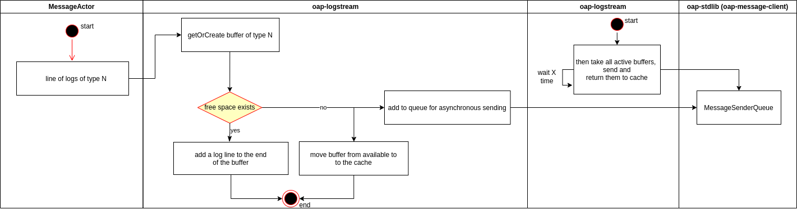

OAP-logstream Binary protocol encoding
===============================

This document describes the wire encoding for OAP-logstream.

# Contents

* [UML digram](#uml-diagram)
  * [Client side](#client-side)
  * [Server side](#server-side)
* [Binary protocol](#binary-protocol)
* [Network](#network)

# UML diagram

## Client side



## Server side


# Binary protocol
```
+--------+--------+-------------------+---------+----------------+-------+---------+------------+----------+
| digId  | length | filePrefixPattern | logType | clientHostname | shard | headers | properties | TSV data |
+--------+--------+-------------------+---------+----------------+-------+---------+------------+----------+
```
* `difId` is a 64-bit number that is a unique buffer id.
* `length` is the size of the data, encoded as an int32, positive values only
* `filePrefixPattern` is a log filename start pattern, encoded is a UTF-8. Properties act as variables.
* `logType` is a UTF-8 log type. Available as ${LOG_TYPE}.
* `clientHostname` is a UTF-8 client hostname. Available as ${CLIENT_HOST}.
* `shard` is a 32-bit number that is a log shard. Available as ${SHARD}.
* `headers` are headers in TSV format, encoded is a UTF-8.
* `properties` is the count of properties, encoded as an int8, positive values only.
  ```
   +-------+------+--------+------+--------+
   | count | key1 | value1 | keyN | valueN |
   +-------+------+--------+------+--------+
  ```
  * `count` is the count of the properties, encoded as an int8, positive values only.
  * `key1...keyN` is a property name, encoded is a UTF-8.
  * `value1...ValueN` is a property value, encoded is a UTF-8.
* `TSV data` is a byte array of length `length`, encoded is a UTF-8. 

# [Network](https://github.com/oaplatform/oap/blob/protocols/docs/oap-message-binary-protocol.md)
